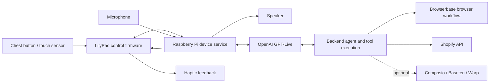

# Wearable AI comm badge — Hack the North 2026

Planning baseline: September 19, 2026. This is a proposed implementation plan, not a working prototype.

Implementation update: the Python GPT-Live client now runs on the Linux development laptop. The team confirmed **QNX OS on the Pi 5**. Native QNX execution is not yet validated; see [QNX prerequisites and audio interface](docs/QNX.md). Earlier Linux/Pi OS suggestions below are superseded by this target decision.

Hardware update: the team identified a **LilyPad SimpleSnap Protoboard**, a Raspberry Pi camera, a speaker with a 3.5 mm plug, and a SparkFun Sound Detector. The protoboard is not itself the Arduino controller; any LilyPad firmware/control role below depends on having the separate controller. The detector supplies analog audio, requiring an audio interface before the Pi can record it. See [current hardware notes](docs/HARDWARE.md). The starter now includes local audio diagnostics; cloud integrations remain unimplemented.

## Product and MVP

A Star Trek–inspired chest badge lets its wearer talk to a personal AI assistant and delegate real tasks without taking out a phone. Hardware available: Raspberry Pi 5 development kit and an unspecified LilyPad board intended for an undershirt. Microphone, speaker, chest input, and vibration hardware still need exact part identification.

The first milestone is microphone → Raspberry Pi → GPT-Live → Raspberry Pi → speaker. Prove this on the bench before sewing or adding external tools. Then add a physical conversation control and distinct haptic feedback for listening, completion, and failure.

Proposed device behavior: press and hold to speak; release to allow a reply; pressing again stops local playback and begins another turn. Confirm the exact GPT-Live audio/playback controls before implementing this. Keep cloud speech activity detection separate from the physical microphone gate. A vibration motor provides feedback; a button or touch sensor supplies input.

Use the Pi as a pocket/belt computer initially, with the badge carrying the lightweight interaction components. Wiring, motor driver, power, and serial interface decisions depend on the actual boards. Do not assume the LilyPad carries audio; plan for audio directly through a supported Pi audio interface and control messages through the LilyPad.

## Proposed architecture

Selected language: Python for voice/session logic and backend tool integrations. Develop on the Linux laptop; the Pi target is QNX, requiring verified Python/SDK ports and native audio helpers before running the same application there. The package lives under `src/commbadge`, dependencies in `pyproject.toml` and `uv.lock`. The existing `scripts/audio_check.py` remains a standalone Linux tool.

OpenAI currently documents GPT-Live separately from the Realtime API. Its examples use `gpt-live-1`; account access has not been tested. For a native device, use the primary Live WebSocket, with raw mono PCM16 at 24 kHz as in the official example. Start with Responses delegation for the first tool flow. Client delegation can later attach a custom agent or Baseten-backed inference, but requires the application to maintain context and orchestrate results. Do not mix Live session events with older Realtime examples.

Keep slow browser/coding tasks outside the audio capture/playback loop. Persist task IDs and states: running, awaiting clarification, completed, failed, cancelled. Stopping speech must not silently mean a business action was cancelled. Check actual tool results before announcing completion. Retries of writes must first check whether the action already succeeded.

Sources: [GPT-Live overview](https://developers.openai.com/api/docs/guides/live), [WebSocket audio guide](https://developers.openai.com/api/docs/guides/voice-websockets?api=live), [delegation and tools](https://developers.openai.com/api/docs/guides/live-delegation).

## Proposed judging scenario

Keep the underlying assistant general-purpose; use a hands-busy merchant scenario to demonstrate a complete task:

> “Computer, check the customer's request in the supplier portal, match it to our catalog, and prepare a draft order for what we can supply.”

Browserbase opens a browser-only portal and extracts a messy request. The agent resolves informal product names against Shopify variants, detects a stale price or missing quantity, and asks one useful clarification. It then creates a draft order in a development store, reads back the resulting record, and reports the result through the badge. A laptop shows the browser session and resulting order for judges.

Use realistic, clearly labeled demonstration fixtures with conflicting aliases, dates, or quantities. Include at least one failure case. Do not describe synthetic fixtures as real customer data. The actual browser operation and Shopify API write should be live. Creating a draft order does not itself mean payment was collected or inventory reserved.

Sources: [Browserbase research-agent example with live view](https://docs.browserbase.com/integrations/vercel/quickstart), [Shopify draftOrderCreate](https://shopify.dev/docs/api/admin-graphql/latest/mutations/draftordercreate).

## Prize fit

Requirements below come from the prize list supplied by the user; award eligibility is not guaranteed.

| Target | Meaningful project contribution | Evidence to show |
| --- | --- | --- |
| OpenAI | GPT-Live voice interaction and backend reasoning | Working badge plus one concrete Codex-assisted implementation, debugging, or testing improvement. Both API use and Codex contribution are judged. |
| Browserbase | Complete a useful workflow in a browser-only portal | Live session, extracted evidence, and resulting action. |
| Rox | Resolve messy information and act despite ambiguity | Conflicting records, validation, clarification, error recovery, and verified output. The supplied rules do not require a Rox API. |
| Shopify | Help a merchant prepare an accurate order while working hands-free | Product matching and a verified draft order in a development store. The supplied rules make Shopify ecosystem usage optional, though direct integration makes the demo concrete. |
| QNX | Run an embedded component under QNX with an AI module listed at oss.qnx.com | Actual local AI execution on QNX hardware or a QNX VM, plus a relevant reliability behavior. Cloud AI alone does not satisfy the hard requirements. |

QNX feasibility gate: the official QNX SDP 8.0 documentation includes a Raspberry Pi 5 BSP, but its listed driver support does not establish compatibility with our unknown microphone/speaker. Before selecting QNX for the audio device, verify boot image/licensing, networking, audio, control I/O, and one qualifying AI module with the sponsor. A candidate role is local recognition of a small command set during network loss, subject to module availability and measured performance. A QNX VM connected to the prototype may be an alternative under the supplied rules; validate the proposed role with the sponsor. Do not claim real-time guarantees for a cloud-dependent assistant.

Timebox initial QNX feasibility work to roughly 60–90 minutes. If it cannot meet a concrete boot-and-inference milestone, preserve the Linux voice MVP and keep QNX as an explicitly unresolved target.

Source: [QNX Pi 5 BSP release notes](https://www.qnx.com/developers/docs/BSP8.0/com.qnx.doc.bsp.releasenotes/topic/rel_sdp80.bsp.broadcom.rpi5.bcm2712.html). The [QNX open-source catalog](https://oss.qnx.com) did not expose enough readable content here to select or verify an AI module.

## Optional sponsors

- Composio: add when the chosen workflow needs an authenticated external integration; it is not a prerequisite for the first Browserbase/Shopify flow.
- Sentry: useful for measuring voice/backend latency and failures. The supplied prize requires at least two products beyond error monitoring; logs and tracing are a reasonable proposed pair. Save a concrete example of data driving a fix.
- Baseten: consider a separate inference task only if it adds measurable value. It is not needed between the microphone and GPT-Live.
- Warp: a wearable command that launches a coding task and reports its status could form a later developer scenario. Using Warp during development alone does not demonstrate that the product improves developer experience. Verify the Oz API before implementing a runtime integration.

## Build order and completion criteria

1. **Audio bench test:** identify hardware and OS; record intelligible speech and play it back on the Pi. Check power and network stability.
2. **Live voice:** establish one authenticated GPT-Live session, speak, hear a response, end it cleanly. Then repeat ten turns while logging latency and errors.
3. **Badge interaction:** connect chest input and haptics; verify debounce, listening indication, playback interruption, and clear disconnected feedback. Address speaker-to-microphone feedback before enabling continuous open-mic conversation.
4. **One real tool:** execute a Browserbase task and speak a verified result. Show failure honestly when the tool fails.
5. **Commerce and messy data:** add the Shopify development store, ambiguous matching, clarification, and draft creation. Test a repeated request without accidentally duplicating the write.
6. **Demo polish:** rehearse a complete interaction, show browser evidence, capture a backup recording, and document Codex's actual contribution. Add optional integrations only after the complete flow works.

QNX feasibility investigation belongs near the start because it can change the OS architecture; full integration follows demonstrated feasibility.

## Existing setup and unresolved inputs

The “Start Browserbase onboarding” task reports Browserbase CLI 0.9.6 installed and API access verified. That is account setup, not a completed browser workflow. At planning time, the workspace contains an existing `.env` and no application source files. Credentials were not printed or copied into this plan.

Needed to implement hardware-specific code: exact LilyPad model, microphone/audio interface, speaker/amplifier, input sensor, haptic actuator/driver, Pi OS and connection method. Also needed for live verification: OpenAI project key and model access, Browserbase project selection, and a Shopify development store with appropriate permissions. Store credentials locally, outside source control.
